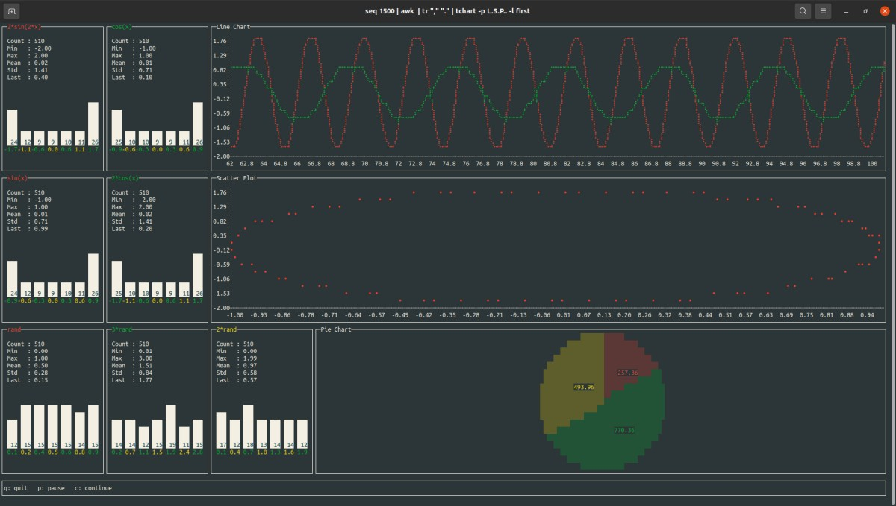
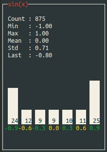
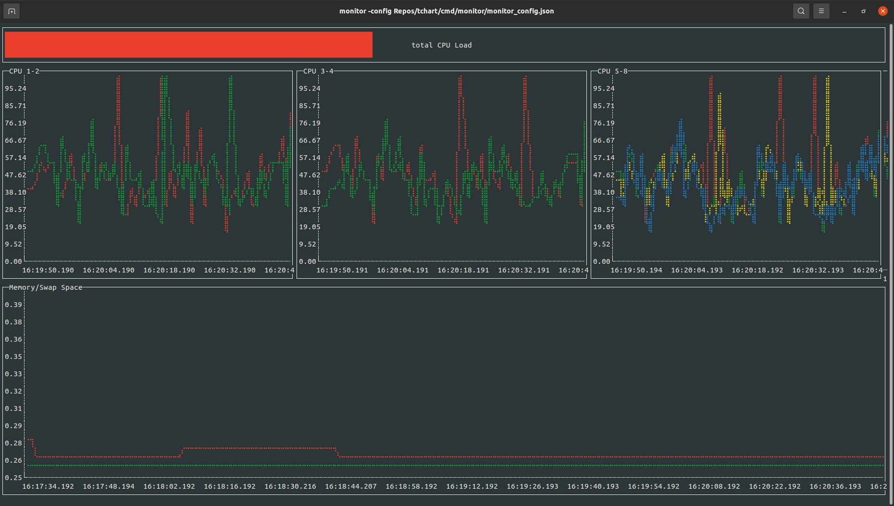

=========
GO-tchart
=========

Library to visualize data in the terminal. 

Available visualizations:

- Barchart
- Gauge
- Linechart
- Pie plot
- Scatter plot
- Statistics as list

Command Line Interfaces
=======================

tchart
------

Command line tool to visualize and inspect table based data in panels.

Installation
^^^^^^^^^^^^

.. code::

    go get github.com/s-westphal/go-tchart/cmd/tchart

Usage
^^^^^

.. code-block:: bash

    tchart --help
   
Input data is read from stdin.

Panels
^^^^^^

Every panel can show data from several columns of the input data.  

On the left side of each panel "statsWidgets" show a summary of each column:

The main chart on the right shows the joined data from all it's columns. The kind 
of chart being displayed is specified by the panel type.

**Panel/Chart Types**:

- Panel type ``[L]`` -> Line chart  (default)

    .. image:: docs/line_chart.jpg

- Panel type ``[S]`` -> Scatter plot 

    .. image:: docs/scatter_plot.jpg
    

- Panel type ``[P]`` -> Pie chart 

    .. image:: docs/pie_chart.jpg

The ``-panels <panel-types>`` cli-option can be used to define the displayed panels.  
``<panel-types>`` is a string containing one character for every column of data,
where the n-th character corresponds to the n-th column.

Possible characters are:

- ``L``, ``S``, ``P``: create a new panel with the according type and display this colum's data.
- ``.``: add this column's data to the previous panel.
- ``x``: skip this column.

**Example:**

    Input Data:

    +--------+----------+-------+-----------+------------+
    | value  | f(value) |skip   | progress_a|  progress_b|
    +========+==========+=======+===========+============+
    |1       | 5        | foo   | 5         |7           |
    +--------+----------+-------+-----------+------------+
    |\...    |          |       |           |            |
    +--------+----------+-------+-----------+------------+

    .. code-block:: bash

        cat input_data | tchart -panels S.xL.

    -> ``S.xL.`` is mapped to the columns:

    .. code::

        "value"         ->  S  =>  create ScatterPlot-Panel
        "f(value)"      ->  .  =>  add to ScatterPlot-Panel
        "skip"          ->  x  =>  skip this column  
        "progress_a"    ->  L  =>  create LineChart-Panel
        "progress_b"    ->  .  =>  add to LineChart-Panel

    => Two panels are displayed, the first one showing a scatter plot with x-values 
    ``value`` and y-values ``f(value)``, the column ``random`` is skipped. The second 
    panel shows a line chart with data from columns ``progress_a`` and ``progress_b``.

**Notes:**

- By default every column is displayed in a separate line chart.
- Scatter plots must contain exactly 2 columns.

Examples
^^^^^^^^

- Scatter plot with 50 points displayed at maximum:

    .. code-block:: bash

        seq 500 | awk 'BEGIN{OFS="\t"; print "rand","2*rand"}{x=$1/5; print rand(),2*rand}' | tchart -panels S. -num-samples 50

- Skip columns using ``x`` in panels option and load data fast:

    .. code-block:: bash

        seq 500 | awk 'BEGIN{OFS="\t"; print "skip","sin(x)","skip","cos(x)"}{x=$1/5; print "foo",sin(x),"bar",cos(x)}' | tchart -panels xLx. -speed fast

- Use first column as labels with option ``-data-label first``:

    .. code-block:: bash

        seq 500 | awk 'BEGIN{OFS="\t"; print "x","sin(x)","cos(x)"}{x=$1/5; print x,sin(x),cos(x)}' | tchart -panels L. -data-label first

- Show different panels at once:

    .. code-block:: bash

        seq 1500 | awk 'BEGIN{OFS="\t"; print "x","2*sin(2*x)","cos(x)","sin(x)","2*cos(x)","rand","3*rand","2*rand"}{x=$1/5; print x,2*sin(2*x),cos(x),sin(x),2*cos(x),rand(),3*rand(),2*rand()}' | tchart -panels L.S.P.. -data-label first

monitor
-------

Command line tool to monitor data retrieved via bash commands over time. 

Installation
^^^^^^^^^^^^

.. code::

    go get github.com/s-westphal/go-tchart/cmd/monitor

Usage
^^^^^

.. code::

    monitor -config <config file>
   
Config File
^^^^^^^^^^^

**Format:**

.. code-block::                                                                       
                                                       
    {                                                                      |                
        "monitor": [                                                       |<-- list of rows
            {                                                              |      
                "height": <height in number of lines of this row>,         |                
                "charts": [                                                |<-- list of charts in row
                    {                                                      |
                        "title": <title_1>,                                |
                        "frequency": <update interval in s>,               |
                        "command": <bash command to retrieve data>,        |
                        "delimiter": <delimiter used in bash command>,     |
                        "plotSpec": <plot type>                            |
                    },                                                     |
                    {                                                      |
                    ...                                                    |
                ]                                                          |
            },                                                             |
            {                                                |
            ...                                                            |
        ]                                                                  |
    }                                                                      |

**Notes:**

-   The ``command`` returns `n` values separated by the string defined in ``delimiter``. E.g.:

    .. code-block:: JSON
        
        ...
        "command": "top -bn1 -1 | awk -F \",\" 'NR==3,NR==4{printf \"%f\t\", 100-$4}'"
        ...

    this returns ``n=2`` values for the usage for CPU 1 and 2 separated by tabs.

-   With the `plotSpec` the plot type and the number of columns is set. Its first character defines the plot type. Available Options:

    - ``B``: Bar chart
    - ``G``: Gauge
    - ``L``: Line chart
    - ``P``: Pie chart
    - ``S``: Scatter plot

    All following charaters are ``.``. The length of the plotSpec has to be equal to the number of values returned by the bash command.

    So for the previous example, the number of returned values was 2, if we want to show a line plot the chart definition would be:

    .. code:: JSON

        ...
        {
            "title": "CPU 1-2",
            "frequency": 1,
            "command": "top -bn1 -1 | awk -F \",\" 'NR==3,NR==4{printf \"%f\t\", 100-$4}'",
            "delimiter": "\t",
            "plotSpec": "L."
        }
        ...

Check out :download: `monitor_config.json <cmd/monitor/monitor_config.json>`_ for more examples.

                                                                                                                                 

License
=======                                              

`MIT <http://opensource.org/licenses/MIT>`_                                              
